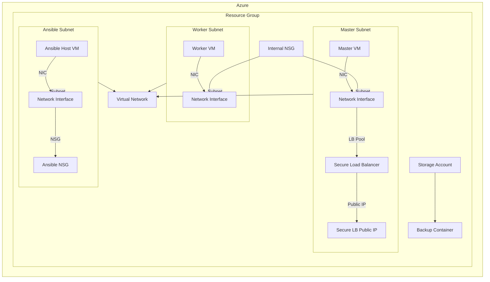

# Azure Terraform Project - Creating a K3s Cluster

This repository contains Terraform configuration files to set up an Azure infrastructure with the following components:

- A virtual network with three subnets: one for master nodes, one for worker nodes, and one for an Ansible host.
- Multiple master and worker nodes as specified by the user.
- Load balancers for the master nodes.
- Network security groups to control access.
- A storage account for backups.

## Project Structure

```
azure_terraform_project/
├── main.tf
├── providers.tf
├── variables.tf
├── cluster-network.tf
├── control-plane.tf
├── data-plane.tf
├── ansible-host.tf
├── back-ups.tf
├── outputs.tf
```

- **main.tf**: Main configuration file that includes other feature-specific files.
- **providers.tf**: Provider configurations.
- **variables.tf**: Variable definitions.
- **cluster-network.tf**: Configuration for the virtual network and subnets.
- **control-plane.tf**: Configuration for master nodes, their load balancers, and network interfaces.
- **data-plane.tf**: Configuration for worker nodes and their network interfaces.
- **ansible-host.tf**: Configuration for the Ansible host and its network security group.
- **back-ups.tf**: Configuration for the storage account and container for backups.
- **outputs.tf**: Output values.

## Current Status

⚠️ **Warning: This project is still under development and is not complete.**

## Architecture Diagram



## How to Use

1. **Initialize Terraform:**
   ```sh
   terraform init
   ```

2. **Plan the deployment:**
   ```sh
   terraform plan
   ```

3. **Apply the deployment:**
   ```sh
   terraform apply
   ```

## Variables

- `resource_group_name`: The name of the resource group.
- `location`: The location for the resources.
- `vnet_name`: The name of the virtual network.
- `master_subnet_name`: The name of the master nodes subnet.
- `worker_subnet_name`: The name of the worker nodes subnet.
- `ansible_subnet_name`: The name of the ansible host subnet.
- `master_vm_name`: The base name of the master node VMs.
- `worker_vm_name`: The base name of the worker node VMs.
- `admin_username`: The admin username for the virtual machines.
- `admin_password`: The admin password for the virtual machines.
- `allowed_ip`: The allowed IP address for SSH and kube API access.
- `master_count`: Number of master nodes.
- `worker_count`: Number of worker nodes.

## Outputs

- `master_vm_private_ip`: Private IP addresses of the master VMs.
- `worker_vm_private_ip`: Private IP addresses of the worker VMs.
- `ansible_vm_public_ip`: Public IP address of the Ansible host VM.
- `secure_lb_public_ip`: Public IP addresses of the secure load balancers.
- `backup_storage_account_name`: Name of the storage account for backups.
- `backup_storage_container_name`: Name of the storage container for backups.
